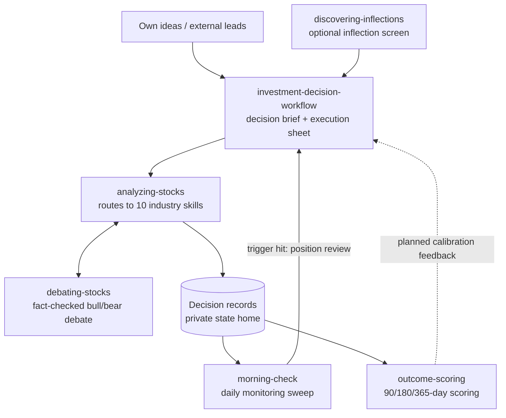

# Adaptive Stock Analysis Framework

English | [简体中文](README.zh-CN.md)

[](https://github.com/Kefan-Lin/adaptive_stock_analysis_framework/actions/workflows/ci.yml)
[](LICENSE)
[](https://www.python.org/downloads/)

Adaptive Stock Analysis Framework is a multi-skill equity research and decision system that adapts the analysis to a company's industry instead of forcing every name through one generic template — and keeps working after the decision: every conclusion is written down as a structured decision record, monitored daily against its own triggers, and scored against realized prices once enough time has passed.

A controller skill routes each company into one of ten industry-specific frameworks, enforces valuation and red-team discipline before any conclusion, and can escalate a contested thesis to a fact-checked adversarial debate engine. The parts that must be reproducible — record validation, monitoring sweeps, outcome scoring — live in deterministic Python scripts, not model judgment.

It is packaged as a GitHub-ready repository that can be cloned and installed for Codex, Claude, and OpenAI-compatible skill workflows.

## How the pieces fit together

Ideas can enter from anywhere — the discovery screen is optional. Research and decision-making run as a one-way pipeline; the loop starts after a decision lands in a record, and it runs for every position regardless of where the idea came from.



- **Entry points are interchangeable.** `discovering-inflections` screens for out-of-favor names with turning fundamentals; a name you bring yourself enters the same mainline.
- **Decision records are the pivot.** Once a decision is recorded, `morning-check` watches its price triggers, scenario drawdown bands, review deadlines, earnings proximity, and put-assignment risk — a trigger hit re-enters the workflow as a position review.
- **Outcome scoring closes the measurement gap, not yet the control loop.** `outcome-scoring` grades matured records against realized prices; feeding those calibration stats back into future confidence-setting is on the roadmap.

## Included

- `investment-decision-workflow` as the end-to-end decision orchestrator (new ideas, report-to-action, position reviews, event reactions)
- `analyzing-stocks` as the research and valuation controller skill, plus 10 industry companion skills
- `debating-stocks` as the fact-checked adversarial bull/bear debate engine for contested theses, events, and positions
- `discovering-inflections` as the upstream screen that feeds inflection candidates into the mainline
- `morning-check` and `outcome-scoring` as thin skill wrappers over the deterministic monitoring and scoring scripts
- `inflection_discovery/`, the code-first counterpart to the discovery skill: point-in-time data, scorecard, backtest harness, and CLI
- 15 shared references covering source policy, financial diagnostics, valuation routing and scenarios, business moat, capital allocation, risk register, macro overlay, portfolio sizing and construction, decision records, and report structure
- per-skill OpenAI metadata (`skills/<skill-name>/agents/openai.yaml`)
- installation scripts for Codex and Claude
- platform docs and example prompts
- a Python test suite and repository validator wired into GitHub Actions CI

## Quick Start

Clone the repository:

```bash
git clone https://github.com/Kefan-Lin/adaptive_stock_analysis_framework.git
cd adaptive_stock_analysis_framework
```

Install for Codex:

```bash
bash install/install-codex.sh
```

Install for Claude:

```bash
bash install/install-claude.sh
```

Install only selected skills:

```bash
bash install/install-codex.sh analyzing-stocks analyzing-software-platforms analyzing-banks
```

Copy instead of symlink:

```bash
bash install/install-codex.sh --copy
```

## Skill Topology

`investment-decision-workflow` routes new ideas, existing reports, live positions, and events through research, valuation, stale checks, incremental valuation updates, decision briefs, and execution sheets.

`debating-stocks` runs a fact-checked bull/bear (or multi-stakeholder) debate to stress-test a contested thesis, judge a corporate-action or event impact, or decide a live position; `analyzing-stocks` and `investment-decision-workflow` escalate to it for the Red-Team / value-trap gate.

`discovering-inflections` screens for depressed, out-of-favor names whose fundamentals show a turning second derivative (A/B/C/D scorecard) and hands the best candidates to `analyzing-stocks`.

`analyzing-stocks` routes companies into one primary industry path:

- `analyzing-software-platforms`
- `analyzing-consumer-retail`
- `analyzing-industrials-transport`
- `analyzing-semiconductors-hardware`
- `analyzing-resource-energy-materials`
- `analyzing-banks`
- `analyzing-insurers`
- `analyzing-real-estate`
- `analyzing-healthcare-biotech`
- `analyzing-utilities-telecom`

See `docs/framework-map.md` for the controller contract and routing structure.

## Deterministic Core

The judgment-heavy work lives in skills; the parts that must be reproducible live in plain Python (stdlib + PyYAML only):

| Script | Purpose |
| --- | --- |
| `scripts/morning_check.py` | Daily sweep of live positions: price triggers, drawdown vs. scenario bands, expired review dates, earnings proximity, put-assignment risk |
| `scripts/outcome_score.py` | Forward-only scoring of matured decision records against realized 90/180/365-day prices, aggregated into calibration tables |
| `scripts/validate_records.py` | Validates a private state home against the decision-records contract |
| `scripts/validate_repo.py` | Validates repository structure (used by CI) |

Decision records and portfolio state live outside the repository in a private state home, located via a `~/.investing-home` pointer file. The record schema is defined in `skills/analyzing-stocks/references/decision-records.md`.

## Inflection Discovery Engine

The `discovering-inflections` skill (LLM-judgment funnel) has a code-first counterpart in `inflection_discovery/`: SEC EDGAR point-in-time reconstruction, the shared A/B/C/D scorecard taxonomy, a backtest harness with a canary battery, and US + A-share discovery pipelines. Both implementations share one scorecard and one point-in-time backtest, so their hit rates can be compared honestly (benchmark artifacts in `reports/`).

```bash
python -m inflection_discovery.cli canary
python -m inflection_discovery.cli backtest
python -m inflection_discovery.cli discover
python -m inflection_discovery.cli ashare-discover
```

## Repository Layout

```text
adaptive_stock_analysis_framework/
├── skills/                # orchestrator, controller + 10 industry skills, debate, discovery, monitoring, scoring
├── inflection_discovery/  # code-first discovery engine: point-in-time data, scorecard, backtest harness, CLI
├── scripts/               # deterministic core: monitoring, scoring, record + repo validation
├── reports/               # discovery benchmark artifacts (LLM vs code-first comparison)
├── install/               # installation scripts
├── docs/                  # platform docs, framework map, design plans
├── examples/              # sample prompts and routing examples
├── tests/                 # unit, contract, and e2e checks
└── .github/               # GitHub Actions CI workflow
```

## Platform Docs

- `docs/platforms/codex.md`
- `docs/platforms/claude.md`
- `docs/platforms/openai.md`

## Examples

- `examples/prompts.md`
- `examples/routing-examples.md`

## Verify

Run the full check suite locally (the same steps GitHub Actions runs on every push and pull request):

```bash
pip install pyyaml
python3 -m unittest discover -s tests -p 'test_*.py' -v
python3 scripts/validate_repo.py --profile full
bash tests/test_install.sh
```

## Roadmap

- Scheduled monitoring: cron-driven morning sweeps with portfolio sync and notification gating (in review)
- Data-driven probability calibration once enough scored outcome history accrues

## License

MIT
