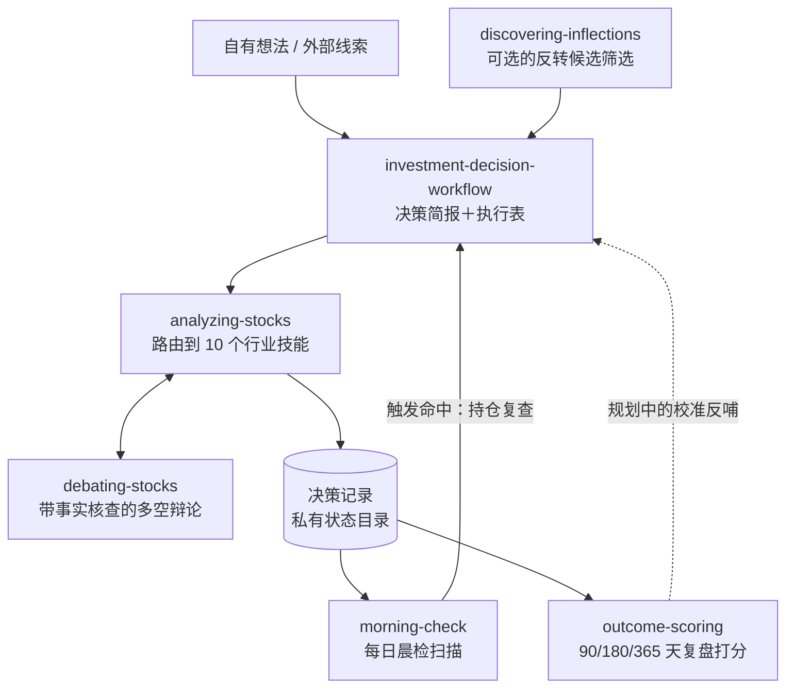

# Adaptive Stock Analysis Framework（自适应股票分析框架）

[English](README.md) | 简体中文

[](https://github.com/Kefan-Lin/adaptive_stock_analysis_framework/actions/workflows/ci.yml)
[](LICENSE)
[](https://www.python.org/downloads/)

自适应股票分析框架是一个多技能的股票研究与决策系统：按公司所处行业自适应地选择分析框架，而不是把每家公司都塞进同一个通用模板——并且在决策之后继续工作：每个结论都会落盘为结构化的决策记录，每天按记录里自带的触发条件被监控，时间成熟后再与已实现价格对比打分。

控制器技能把每家公司路由到十个行业专属框架之一，在得出任何结论之前强制执行估值与红队纪律，并可以把有争议的论点升级到带事实核查的对抗辩论引擎。必须可复现的部分——记录校验、监控扫描、成绩打分——由确定性的 Python 脚本完成，不交给模型判断。

仓库开箱即用，克隆后可安装到 Codex、Claude 以及 OpenAI 兼容的技能工作流。

## 整体结构

想法可以从任何入口进入——发现筛选只是可选项。研究与决策是一条单向流水线；回路从决策落盘为记录之后才开始运转，并且对所有持仓生效，无论这只票最初来自哪个入口。



- **入口可互换。** `discovering-inflections` 负责筛选失宠但基本面出现拐点的标的；你自己带来的标的走的是同一条主线。
- **决策记录是枢纽。** 决策一旦落盘，`morning-check` 就开始盯它的价格触发线、情景回撤区间、复查截止日、临近财报和期权行权风险——触发命中后，以持仓复查的形式重新进入工作流。
- **成绩复盘目前闭合的是"测量"，还不是"控制"。** `outcome-scoring` 对到期记录与已实现价格打分；把这些校准统计反哺到未来决策的置信度设定，还在路线图上。

## 包含内容

- `investment-decision-workflow`：端到端决策编排器（新想法、报告转行动、持仓复查、事件应对）
- `analyzing-stocks`：研究与估值控制器技能，外加 10 个行业配套技能
- `debating-stocks`：带事实核查的多空对抗辩论引擎，用于有争议的论点、事件和持仓
- `discovering-inflections`：上游反转筛选，把候选标的送入决策主线
- `morning-check` 与 `outcome-scoring`：确定性监控与打分脚本之上的轻量技能包装
- `inflection_discovery/`：发现技能的代码优先实现——时点数据、记分卡、回测框架和 CLI
- 15 个共享 references，覆盖信息来源政策、财务诊断、估值路由与情景、商业护城河、资本配置、风险登记、宏观叠加、仓位与组合构建、决策记录、报告结构
- 每个技能各自的 OpenAI 元数据（`skills/<skill-name>/agents/openai.yaml`）
- Codex 与 Claude 的安装脚本
- 平台文档与示例提示词
- Python 测试套件与仓库校验器，已接入 GitHub Actions CI

## 快速开始

克隆仓库：

```bash
git clone https://github.com/Kefan-Lin/adaptive_stock_analysis_framework.git
cd adaptive_stock_analysis_framework
```

安装到 Codex：

```bash
bash install/install-codex.sh
```

安装到 Claude：

```bash
bash install/install-claude.sh
```

只安装部分技能：

```bash
bash install/install-codex.sh analyzing-stocks analyzing-software-platforms analyzing-banks
```

用复制代替软链接：

```bash
bash install/install-codex.sh --copy
```

## 技能拓扑

`investment-decision-workflow` 把新想法、已有报告、在手持仓和事件统一路由到研究、估值、过期检查、增量估值更新、决策简报和执行表。

`debating-stocks` 运行带事实核查的多空（或多利益方）辩论，用来压力测试有争议的论点、判断公司行动或事件的影响、对在手持仓做出裁决；`analyzing-stocks` 和 `investment-decision-workflow` 在红队 / 价值陷阱门环节升级到它。

`discovering-inflections` 筛选被打压、失宠但基本面二阶导出现拐点的标的（A/B/C/D 记分卡），把最好的候选交给 `analyzing-stocks`。

`analyzing-stocks` 把公司路由到一条主行业路径：

- `analyzing-software-platforms`
- `analyzing-consumer-retail`
- `analyzing-industrials-transport`
- `analyzing-semiconductors-hardware`
- `analyzing-resource-energy-materials`
- `analyzing-banks`
- `analyzing-insurers`
- `analyzing-real-estate`
- `analyzing-healthcare-biotech`
- `analyzing-utilities-telecom`

控制器契约与路由结构见 `docs/framework-map.md`。

## 确定性核心

依赖判断的工作放在技能里；必须可复现的部分用纯 Python 实现（仅标准库 + PyYAML）：

| 脚本 | 用途 |
| --- | --- |
| `scripts/morning_check.py` | 每日扫描在手持仓：价格触发线、回撤对照情景区间、过期复查日、临近财报、期权行权风险 |
| `scripts/outcome_score.py` | 仅向前的成绩打分：将到期决策记录与已实现的 90/180/365 天价格对比，汇总为校准表 |
| `scripts/validate_records.py` | 按决策记录契约校验私有状态目录 |
| `scripts/validate_repo.py` | 校验仓库结构（CI 使用） |

决策记录与组合状态存放在仓库之外的私有状态目录中，通过 `~/.investing-home` 指针文件定位。记录 schema 定义在 `skills/analyzing-stocks/references/decision-records.md`。

## 反转发现引擎

`discovering-inflections` 技能（LLM 判断漏斗）在 `inflection_discovery/` 里有一个代码优先的对应实现：SEC EDGAR 时点数据重建、共享的 A/B/C/D 记分卡体系、带金丝雀测试组的回测框架，以及美股 + A 股发现管线。两个实现共享同一套记分卡和同一个时点回测，因此命中率可以被诚实地对比（基准产物在 `reports/`）。

```bash
python -m inflection_discovery.cli canary
python -m inflection_discovery.cli backtest
python -m inflection_discovery.cli discover
python -m inflection_discovery.cli ashare-discover
```

## 仓库布局

```text
adaptive_stock_analysis_framework/
├── skills/                # 编排器、控制器 + 10 个行业技能、辩论、发现、监控、打分
├── inflection_discovery/  # 代码优先的发现引擎：时点数据、记分卡、回测框架、CLI
├── scripts/               # 确定性核心：监控、打分、记录与仓库校验
├── reports/               # 发现引擎基准产物（LLM 与代码实现的对比）
├── install/               # 安装脚本
├── docs/                  # 平台文档、框架地图、设计方案
├── examples/              # 示例提示词与路由示例
├── tests/                 # 单元、契约与端到端检查
└── .github/               # GitHub Actions CI 工作流
```

## 平台文档

- `docs/platforms/codex.md`
- `docs/platforms/claude.md`
- `docs/platforms/openai.md`

## 示例

- `examples/prompts.md`
- `examples/routing-examples.md`

## 本地校验

在本地运行完整检查（与 GitHub Actions 在每次 push 和 pull request 上运行的步骤相同）：

```bash
pip install pyyaml
python3 -m unittest discover -s tests -p 'test_*.py' -v
python3 scripts/validate_repo.py --profile full
bash tests/test_install.sh
```

## 路线图

- 定时监控：cron 驱动的晨检扫描，带组合同步与通知去重门（评审中）
- 积累足够的复盘打分历史后，做数据驱动的概率校准

## 许可证

MIT
